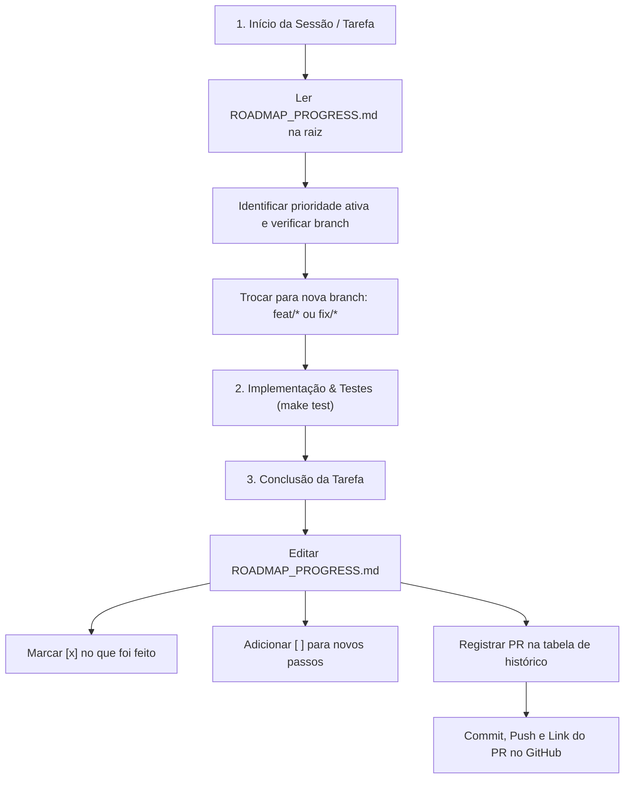

# 🗺️ Roadmap Tracker Skill — TerapiaInFoco

Esta skill estabelece o protocolo obrigatório de governança e rastreamento contínuo de tarefas no projeto **TerapiaInFoco** baseado na especificação **RFC-001**.

---

## 📌 Protocolo Obrigatório em 3 Etapas



---

## 1. Ao Iniciar Qualquer Próxima Tarefa

Sempre que o usuário solicitar uma nova funcionalidade, correção, melhoria ou perguntar *"quais próximos passos?"*:

1. **Leitura Obrigatória:**
   - Leia imediatamente o arquivo [`ROADMAP_PROGRESS.md`](./ROADMAP_PROGRESS.md) na raiz do repositório.
   - Verifique quais módulos já foram finalizados e quais estão pendentes no roadmap.
2. **Alinhamento com o Usuário:**
   - Confirme a prioridade selecionada a partir dos itens marcados como pendentes (`[ ]`).
3. **Disciplina Estrita de Branches:**
   - **NUNCA** comite alterações diretamente na branch `main`.
   - Crie e mude para uma nova branch descritiva antes de escrever código:
     ```bash
     git checkout main && git pull origin main
     git checkout -b feat/<nome-da-funcionalidade>
     ```

---

## 2. Durante a Implementação

1. **Preservação de Padrões e Normas:**
   - Manter conformidade com a **RFC-001**, Resoluções do CFP (001/2009, 011/2018, 006/2019) e LGPD (Art. 11, Art. 16).
   - Manter compatibilidade com ambos os temas: **Light Mode** e **Dark Mode**.
2. **Validação Contínua:**
   - Execute a suíte de testes automatizados:
     ```bash
     bun test
     ```
   - Verifique a integridade dos builds do monorepo:
     ```bash
     bun run build:frontend
     bun run build:landing
     ```

---

## 3. Ao Concluir a Tarefa (Atualização Obrigatória)

Assim que o código estiver implementado e todos os testes passarem:

1. **Atualizar `ROADMAP_PROGRESS.md`:**
   - Localize a seção correspondente no arquivo.
   - **Marcar o que foi feito:** Altere os checkboxes de `[ ]` para `[x]` nos itens concluídos.
   - **Registrar o Pull Request:** Adicione uma nova linha na tabela `📌 Histórico de Branches & Pull Requests` com a branch, o escopo e o link/status do PR.
   - **Mapear os Próximos Passos:** Garanta que os passos subsequentes estejam claramente listados com `[ ]` e com as orientações necessárias para quem continuar em seguida.
2. **Commit e Envio:**
   - Adicione os arquivos alterados e faça o commit com mensagem semântica (Conventional Commits):
     ```bash
     git add .
     git commit -m "feat/fix: descrição clara da alteração"
     git push -u origin <nome-da-branch>
     ```
3. **Disponibilizar o Link do PR:**
   - Forneça ao usuário o link direto para criar/revisar o Pull Request no GitHub:
     `https://github.com/linuxsoares/terapiainfoco/pull/new/<nome-da-branch>`
